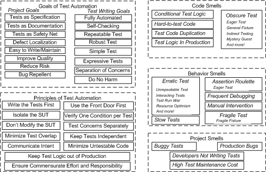
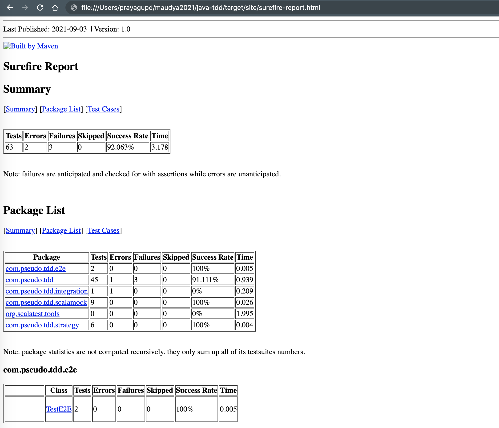

Java TDD
=============

- Unit testing
- Integration testing
- System testing
- Acceptance testing

References:
- https://martinfowler.com/articles/practical-test-pyramid.html


1: Unit Testing
-----------------

  [xUnit Test Patterns: Refactoring Test Code](http://xunitpatterns.com/Code%20Refactorings.html)
  
  

1.1 Test Doubles: [Stub vs Mock vs Spy](http://stackoverflow.com/a/3459491/432903)
---
 
Stub
---

- It's a `stub<>` if you have the behaviour pre-determined, you don't verify the calls.
  `stub` also referred to as state-based.
- they always respond with the same static response regardless of input.
  
  Ex.
  
  ```java
  class SubjectToTest {
    private Dependency dependency;
    
    public String doSomething(){
        //dependency.doSomething() is already defined, so its mock[]ed
        dependency.doSomething() + "-something else";
    }
  }
  ```
  
  ```java
  interface DependencyStub {
      String doSomething();
      String doSomething2();
  }
  
  class DependencyStubImpl implements DependencyStub {
  
    public String doSomething(){
       // define the behaviour
       return "static something";
    }
  
    public String doSomething2(){
      return "static something 2";
    }
  }
  ```
  
  ```java
  public class Test {
    Dependency stub = new DependencyStubImpl();
    SubjectToTest subject = new SubjectToTest(stub);
  }
  ```

Spy
---
- a spy would allow you to stub out one of subject functions and 
leave the rest of the class behaving as normal.
- The spy can tell the test what parameters it was given, how many times it was called


  ```groovy
  def "should deliver and update the state"() {
    given:
    String orderId = "order-id"
    String newState = "state change"
  
    serviceA.serviceB = Spy(ServiceB)
    serviceA.serviceB.deliverOrder(orderId) >> newState
  
    when:
    String state = serviceA.deliverOrder(orderId)
  
    then:
    state == orderId + "-" + newState
  }
  ```

Mock
----

- It is a `mock<>` if you `verify()` calls against it.
- Allows complete control over the doubled entity and provide the same information as a `spy` regarding how the entity has been interacted with
- Mocks are configured before the code under test is executed to behave however we would like.

  ```groovy
    def "should execute and make relevant calls"() {
        serviceA.serviceB = Mock(ServiceB)
  
        given:
        String orderId = "order-id"
  
        when:
        serviceA.executeSomething(orderId)
  
        then:
        1 * serviceA.serviceB.doSomething1(_, _)
        1 * serviceA.serviceB.doSomething2(_)
        1 * serviceA.serviceB.doSomething3(_)
        1 * serviceA.serviceB.doSomething4(_, _)
    }
  ```


UT Practices
-------------

- test names should tell what it is testing (Documentation)

  ```groovy
  def "should ship an order, given valid order" () {
    
  }
  ```

- test should be deterministic
- test one scenario per test
  ```groovy
  def "should ship an order, given valid order" () {
  
    then:
    order.state == OrderState.Shipped
  }
  ```

- avoid database, cache, HTTP calls as part of unit tests(those are integration/ end to end tests)
  ```groovy
  def "should ship an order, given valid order" () {
    given:
    subject.cacheService = Stub(CacheService)
    subject.shippingMicroservice = Stub(ShippingMicroservice)
    
    then:
    order.state == OrderState.Shipped
  } 
  ```

- should detect code smells in codebase.
- target quality over coverage
- [Static Methods are Death to Testability, Google Inc](https://testing.googleblog.com/2008/12/static-methods-are-death-to-testability.html)

  _The basic issue with static methods is they are procedural code. I have no idea how to unit-test procedural code. Unit-testing assumes that I can instantiate a piece of my application in isolation. During the instantiation I wire the dependencies with mocks/friendlies which replace the real dependencies. With procedural programing there is nothing to "wire" since there are no objects, the code and data are separate._

Code coverage
----

- If you make a certain level of coverage a target, people will try to attain it. The trouble is that high coverage numbers are too easy to reach with low quality testing.
- If you are testing thoughtfully and well, I would expect a coverage percentage in the upper 80s or 90s.

<h5>References</h5>
- https://martinfowler.com/articles/mocksArentStubs.html#SoShouldIBeAClassicistOrAMockist
- https://martinfowler.com/bliki/TestCoverage.html
- [s-coverage plugin](https://github.com/nihil-os/scoverage-maven-plugin)


  ```bash
  ./gradlew clean test
  
  ## using maven
  mvn clean test
  
  ## test HTML reports
  mvn surefire-report:report
  
  ## using sbt
  sbt test
  ```


  

  ```bash
  ls -l target/surefire-reports/
  total 872
  -rw-r--r--  1 prayagupd NA\Domain Users   9558 Sep  3 10:13 TEST-com.pseudo.tdd.CaseClassFunSpecs.xml
  -rw-r--r--  1 prayagupd NA\Domain Users  13170 Sep  3 10:13 TEST-com.pseudo.tdd.ExceptionInsideTrySuccess.xml
  -rw-r--r--  1 prayagupd NA\Domain Users   8995 Sep  3 10:13 TEST-com.pseudo.tdd.FunctionalMapSpecs.xml
  -rw-r--r--  1 prayagupd NA\Domain Users  12323 Sep  3 10:13 TEST-com.pseudo.tdd.FutureSpecs.xml
  -rw-r--r--  1 prayagupd NA\Domain Users  12230 Sep  3 10:13 TEST-com.pseudo.tdd.FutureTests.xml
  -rw-r--r--  1 prayagupd NA\Domain Users  12341 Sep  3 10:13 TEST-com.pseudo.tdd.GenericsTests.xml
  -rw-r--r--  1 prayagupd NA\Domain Users  19352 Sep  3 10:13 TEST-com.pseudo.tdd.IUseStaticClassSpecs.xml
  -rw-r--r--  1 prayagupd NA\Domain Users   8623 Sep  3 10:13 TEST-com.pseudo.tdd.ImplicitlySpecs.xml
  -rw-r--r--  1 prayagupd NA\Domain Users   8964 Sep  3 10:13 TEST-com.pseudo.tdd.MaybeMonadSpecs.xml
  -rw-r--r--  1 prayagupd NA\Domain Users   8920 Sep  3 10:13 TEST-com.pseudo.tdd.MockitoTestSpecs.xml
  -rw-r--r--  1 prayagupd NA\Domain Users   8648 Sep  3 10:13 TEST-com.pseudo.tdd.ObjectMapperSpecs.xml
  -rw-r--r--  1 prayagupd NA\Domain Users   8978 Sep  3 10:13 TEST-com.pseudo.tdd.ServiceASpec.xml
  -rw-r--r--  1 prayagupd NA\Domain Users   8688 Sep  3 10:13 TEST-com.pseudo.tdd.ServiceASpecsUsingScalaMock.xml
  -rw-r--r--  1 prayagupd NA\Domain Users   8872 Sep  3 10:13 TEST-com.pseudo.tdd.ServiceAStepwiseSpec.xml
  -rw-r--r--  1 prayagupd NA\Domain Users  12265 Sep  3 10:13 TEST-com.pseudo.tdd.ServiceATest.xml
  -rw-r--r--  1 prayagupd NA\Domain Users  19399 Sep  3 10:13 TEST-com.pseudo.tdd.StaticClassSpecs.xml
  -rw-r--r--  1 prayagupd NA\Domain Users   8618 Sep  3 10:13 TEST-com.pseudo.tdd.ThreeSumSpecs.xml
  -rw-r--r--  1 prayagupd NA\Domain Users   8777 Sep  3 10:13 TEST-com.pseudo.tdd.e2e.TestE2E.xml
  -rw-r--r--  1 prayagupd NA\Domain Users  12165 Sep  3 10:13 TEST-com.pseudo.tdd.integration.RunCukeTests.xml
  -rw-r--r--  1 prayagupd NA\Domain Users  12167 Sep  3 10:13 TEST-com.pseudo.tdd.integration.ServerIntSpecs.xml
  -rw-r--r--  1 prayagupd NA\Domain Users   8894 Sep  3 10:13 TEST-com.pseudo.tdd.scalamock.FunctionStubSpecs.xml
  -rw-r--r--  1 prayagupd NA\Domain Users   8702 Sep  3 10:13 TEST-com.pseudo.tdd.scalamock.GameScalaMockSpecs.xml
  -rw-r--r--  1 prayagupd NA\Domain Users   8648 Sep  3 10:13 TEST-com.pseudo.tdd.scalamock.MultipleParamsStub.xml
  -rw-r--r--  1 prayagupd NA\Domain Users   8690 Sep  3 10:13 TEST-com.pseudo.tdd.scalamock.MyScalamockTrait.xml
  -rw-r--r--  1 prayagupd NA\Domain Users   8635 Sep  3 10:13 TEST-com.pseudo.tdd.scalamock.NoParamStub.xml
  -rw-r--r--  1 prayagupd NA\Domain Users   8648 Sep  3 10:13 TEST-com.pseudo.tdd.scalamock.ScalaMockJavaClass.xml
  -rw-r--r--  1 prayagupd NA\Domain Users   8666 Sep  3 10:13 TEST-com.pseudo.tdd.scalamock.ScalaStubTrait.xml
  -rw-r--r--  1 prayagupd NA\Domain Users   9002 Sep  3 10:13 TEST-com.pseudo.tdd.strategy.ApplicationRouterSpecs.xml
  -rw-r--r--  1 prayagupd NA\Domain Users   8946 Sep  3 10:13 TEST-com.pseudo.tdd.strategy.EventDispatcherSpecs.xml
  -rw-r--r--  1 prayagupd NA\Domain Users   8529 Sep  3 10:13 TEST-org.scalatest.tools.DiscoverySuite-bbd206b0-f9b5-4984-86ac-de02598ddae3.xml
  -rw-r--r--  1 prayagupd NA\Domain Users    271 Sep  3 10:13 com.pseudo.tdd.FutureTests.txt
  -rw-r--r--  1 prayagupd NA\Domain Users    273 Sep  3 10:13 com.pseudo.tdd.GenericsTests.txt
  -rw-r--r--  1 prayagupd NA\Domain Users   7154 Sep  3 10:13 com.pseudo.tdd.IUseStaticClassSpecs.txt
  -rw-r--r--  1 prayagupd NA\Domain Users    272 Sep  3 10:13 com.pseudo.tdd.ServiceASpec.txt
  -rw-r--r--  1 prayagupd NA\Domain Users    272 Sep  3 10:13 com.pseudo.tdd.ServiceATest.txt
  -rw-r--r--  1 prayagupd NA\Domain Users   7146 Sep  3 10:13 com.pseudo.tdd.StaticClassSpecs.txt
  -rw-r--r--  1 prayagupd NA\Domain Users    284 Sep  3 10:13 com.pseudo.tdd.integration.RunCukeTests.txt
  -rw-r--r--  1 prayagupd NA\Domain Users    286 Sep  3 10:13 com.pseudo.tdd.integration.ServerIntSpecs.txt
  -rw-r--r--  1 prayagupd NA\Domain Users   5401 Sep  3 10:13 test-suite.log
  ```

[2: Functional Testing](2-functional-tests.md)
--------------------

3: [Smoke Testing/ Sanity Testing](https://en.wikipedia.org/wiki/Smoke_testing_(software))/ build verification test
---------------------------------

- http://softwaretestingfundamentals.com/smoke-testing/
- https://medium.com/hootsuite-engineering/our-journey-in-smoke-test-frameworks-6a1fb30572e2

```
A smoke tester will select and run a subset of test cases that cover 
the most important functionality of a component or system.
```

_it is a set of tests run on each new build of a product to verify that the build is
testable before the build is released into the hands of the test team_

`mvn shakedown`


4: [Regression Testing](https://en.wikipedia.org/wiki/Regression_testing)
-------------

```
 verifies that software, which was previously developed and tested, still performs correctly after it was changed 
 or interfaced with other software.
```

[Non functional/ Perf Testing](non-functional-tests.md)
--------------------------------------

Further TDD reading
----

- https://cucumber.io/docs/installation/java/
- https://www.testcontainers.org/#about

- https://github.com/vaquarkhan/vaquarkhan/blob/master/Design/building-microservices-designing-fine-grained-systems.pdf
- https://abseil.io/resources/swe-book/html/ch14.html#functional_testing_of_one_or_more_inter
- 
- [The Case Against TDD - Eric Smith](https://www.youtube.com/watch?v=nRdn5k5jKyY)

- [Real world mutation testing](http://pitest.org/)

_Faults (or mutations) are automatically seeded into your code,
then your tests are run._

_If your tests fail then the mutation is killed, if your tests pass then the mutation lived._

- [How Car Testing Works](http://auto.howstuffworks.com/car-driving-safety/safety-regulatory-devices/car-testing1.htm)

- https://8thlight.com/blog/uncle-bob/2014/05/14/TheLittleMocker.html

- https://www.amazon.com/dp/0321146530/?tag=stackoverfl08-20

- [Using Mockito's ArgumentCaptor in Scala](http://blog.themillhousegroup.com/2013/11/using-mockitos-argumentcaptor-in-scala.html)

- [ScalaTest and Mockito: Functions](http://bleibinha.us/blog/2013/11/scalatest-and-mockito-functions)

- [Testing styles in ScalaTest : PropSpec with TableDrivenPropertyChecks with Matchers, WordSpec etc](http://yeghishe.github.io/2015/05/31/scalatest-testing-styles.html)

- [Suite with ShouldMatchers, FunSuite, FeatureSpec with GivenWhenThen](https://blog.knoldus.com/2011/05/16/working-with-scala-test/)

- 

- [scalamock, native scala testing](https://github.com/paulbutcher/scalamock#features)

- implicits: https://github.com/paulbutcher/ScalaMock/issues/79
